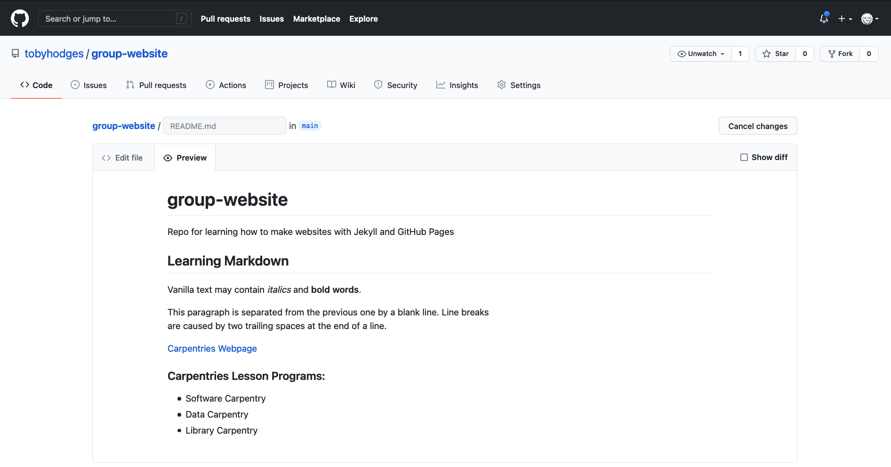
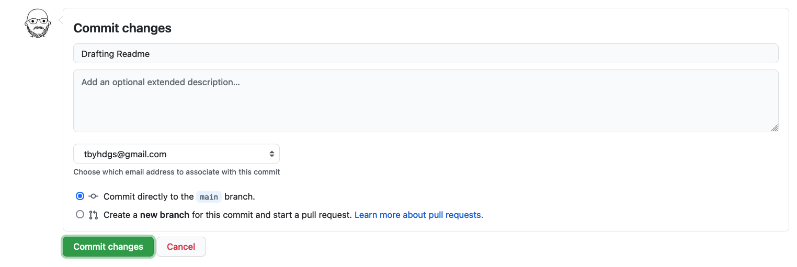
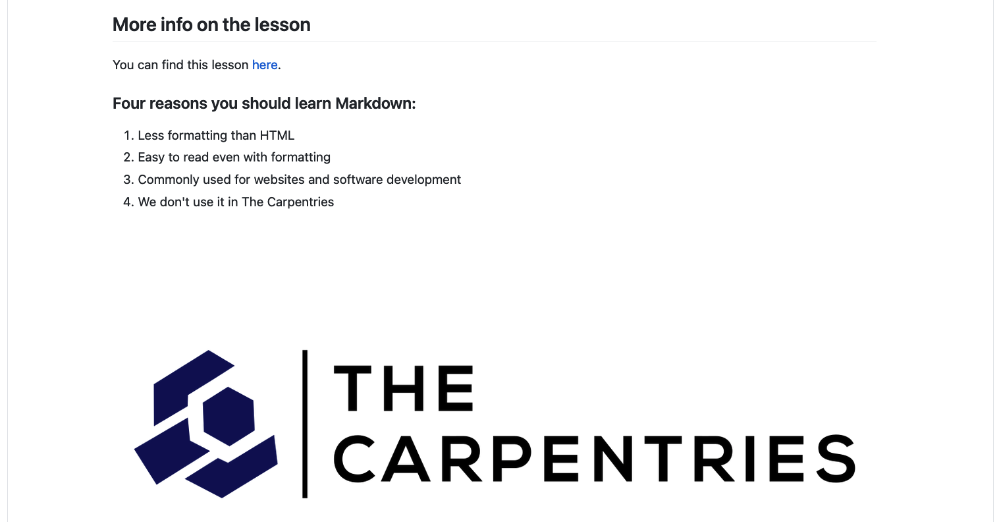

# Markdown
Markdown is a lightweight markup language, i.e. a convention for adding
style information to textual content.
As the name Markdown indicates, the syntax elements of this language
are shut *down* to a minimum.
Having a rather minimalistic syntax, text formatted in Markdown is comparably
readable.
This might be one reason for Markdown having become the language of choice
for formatted user input on websites like, for example:
- [Stack Exchange](https://stackexchange.com/)
- [GitHub](https://github.com/)
- [GitLab](https://about.gitlab.com/).

# Where to Start Writing Markdown?
A lot of tools for rendering Markdown source code exist.
Rendering is the process of generating a nice view of the content
using the style information included in the source text.
Chances are high, your editor can do this.
As we are working towards authoring websites using Jekyll and GitHub pages,
we will use GitHub straight away for learning the basics of Markdown.
The GitHub project you created in the last episode contains a file `README.md`.

The image below shows the projects default view.
This view includes a rendered view of the content inside the file `README.md`.
Your project should look quite similar except for the red circle around the pencil symbol.

{: .image-with-shadow width="900px" }

Click on that pencil symbol to open an editing interface of your project's `README.md` file.
Once we've clicked the pencil symbol, GitHub will open that file in the editing interface.

{: .image-with-shadow width="900px" }

We can change the content and have a look at the rendered view by clicking the _Preview changes_ tab.

{: .image-with-shadow width="900px" }

Let's add `Some **bold** font` and see what happens when we preview it using the preview tab.
If you check the "Show diff" box on the upper-right hand side, GitHub will show green vertical bars visually highlighting the new content.
To save the content to the file `README.md`, scroll down a bit and search for a _Commit changes_ menu
at the bottom of the page.
After having changed something, the commit menu looks like this:

{: .image-with-shadow width="900px" }

> ## Writing a Commit Message
>
> A commit message is a short, descriptive, and specific comment that will help us remember later on what we did and why.
> You find more about writing commit message in [this section][swc-git-novice-episode-track-changes] of the Git-novice lesson.
>
{: .callout}

Commit this change to the `main` branch.

# Writing Markdown

Now that we know about the editing interface and preview tab of our projects `README.md`
we can use it as a text editor and investigate selected Markdown features.

Our `README.md` already contains vanilla text and
two formatting features:
- Heading `# group-website`
- Emphasis using `**bold**`.

Let's learn some more Markdown by adding some formatting and see what happens when we preview it using the preview tab.
Add the following to your `README.md` file.

~~~
# group-website
Repo for learning how to make websites with Jekyll pages

## Learning Markdown

Vanilla text may contain *italics* and **bold words**.

This paragraph is separated from the previous one by a blank line.
Line breaks
are caused by two trailing spaces at the end of a line.

[Carpentries Webpage](https://carpentries.org/)

### Carpentries Lesson Programs:
- Software Carpentry
- Data Carpentry
- Library Carpentry
~~~
{: .language-markdown }

You can then click the preview tab again to see how the formatting renders.

{: .image-with-shadow width="900px" }

If you click the `Show diff` checkbox in the right corner, GitHub will include a preview of differences too - 
the green bar indicates added lines, the red bar indicates deleted lines, and yellow - lines that have been modified.

> ## Markdown Trailing Spaces Are Meaningful
>
> In the example above there are two spaces at the end of `Line breaks  `.
> These introduce what is called a **hard line break**, causing that paragraph to
> continue in the next line by adding a ` ` to the generated HTML.
>
> If you break the line in a markdown file but don't include the two trailing spaces
> the generated HTML will continue in the same line **without** introducing a ` `.
> This is called a **soft line break**.
>
> In some cases you may find that **soft line breaks** do introduce a ` `.
> This can happen when using different [markdown flavors](#markdown-flavours).
>
> See for instance:
> ~~~
> Soft line
> break
>
> Hard line
> break
> ~~~
> {: .language-markdown }
>
> That produces:
>
> {: .image-with-shadow width="200px" }
>
{: .callout}

To keep this addition to our `README.md` we need to commit these changes to save them.
Scroll down to the bottom of the page, add a commit message if you wish, and then commit to the `main` branch.

{: .image-with-shadow width="800px" }

Let's do an exercise to try out writing more markdown.

> ## Exercise: Try Out Markdown
> Use [this cheatsheet][https://www.markdownguide.org/basic-syntax/] to add the following to your `README.md`:
>
> - Another second level heading
> - Some text under that second level heading that includes an link and ~~strikethrough~~ text.
> - A third level heading
> - A numbered list
> - Bonus: Add this image <https://github.com/carpentries/carpentries.org/blob/main/images/TheCarpentries-opengraph.png>
>
> > ## Example Solution
> > For example your markdown might look like the following:
> > ~~~
> > ## More info on the lesson
> > You can find this lesson [here](https://carpentries-incubator.github.io/jekyll-pages-novice/).
> >
> > ### Four reasons you should learn Markdown:
> >
> > 1. Less formatting than HTML
> > 2. Easy to read even with formatting
> > 3. Commonly used for websites and software development
> > 4. We ~~don't~~ use it in The Carpentries
> >
> > 
> > ~~~
> > {: .language-markdown }
> > {: .image-with-shadow width="800px" }
> >
> {: .solution }
{: .challenge }

> ## Reference-Style Links
>
> Up to now, we have used _inline-style_ links which have the URL inline with the description text, for example:
>
> ~~~
> [Carpentries Webpage](https://carpentries.org/)
> ~~~
> {: .language-markdown }
>
> If you use a link more than once, consider using so called _reference-style_ links instead.
> Reference-style links reference the URL via a label.
> The label goes into square brackets `[ ]` right after the description text of the link and
> then later, usually at the bottom of the page, you can connect that label to the url it references to complete the link.
> This looks like:
> ~~~
> [Carpentries Webpage][carpentries]
>
> [carpentries]: https://carpentries.org/
> ~~~
> {: .language-markdown }
>
> and helps to follow the [DRY principle][dry-principle], avoiding redundant specification of information.
>
{: .callout}

We will continue to use Markdown and learn more throughout the rest of the lesson.
Though later we will find we need HTML again for some features.

> ## Markdown Cheatsheet
>
> Markdown offers a variety of formatting features.
> Have a look at this [cheatsheet][github-flavored-markdown] to get an overview or look things up.
{: .callout}

> ## Markdown Flavours
>The initial description of Markdown was informal and contained certain ambiguities so over the years [different Markdown
>implementations and syntax variations](https://github.com/commonmark/commonmark-spec/wiki/markdown-flavors) (often referred to as "flavours")
>appeared to support various syntax features and extensions. As a consequence, the syntax from one variant may not
>be interpreted as expected in another - you have to be aware which one is being used by a particular platform. Here are
>a few well-known variants:
>   - [GitHub-flavored Markdown][github-flavored-markdown] (used on this lesson and by GitHub)
>   - [GitLab-flavored Markdown][gitlab-flavored-markdown] (used by GitLab)
>   - [Kramdown][kramdown] (a fast, Ruby, open source implementation released under the MIT licence)
{: .callout}

{: .challenge }

>## More Markdown Features
> Check out our [Extras page on Markdown](../more_markdown/index.html) for a more comprehensive overview of
> Markdown, including how to create fenced code blocks
> and do syntax highlighting for various languages.
{: .callout}


